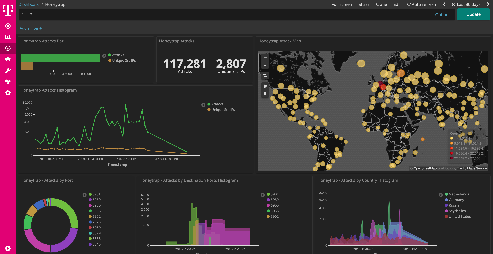

 

# honeytrap

[honeytrap](https://github.com/tillmannw/honeytrap) is a low-interaction honeypot daemon for observing attacks against network services. In contrast to other honeypots, which often focus on malware collection, honeytrap aims for catching the initial exploit – It collects and further processes attack traces.

This dockerized version is part of the **[T-Pot community honeypot](http://dtag-dev-sec.github.io/)** of Deutsche Telekom AG.

The `Dockerfile` contains the blueprint for the dockerized honeytrap and will be used to setup the docker image.  

The `docker-compose.yml` contains the necessary settings to test honeytrap using `docker-compose`. This will ensure to start the docker container with the appropriate permissions and port mappings.

# Honeytrap Dashboard

